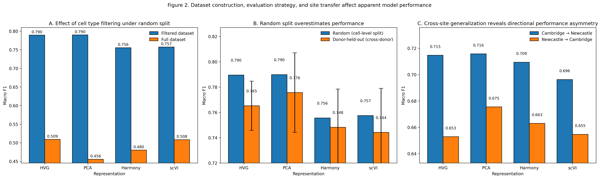

# scRNA-cross-donor-generalization

**Random Cell-Level Splits Introduce Systematic Bias in scRNA-seq Cell Type Annotation Benchmarks**  
This repository contains all code and results required to reproduce the analyses in the associated manuscript.   

- Manuscript: https://docs.google.com/document/d/1ljOWM2J1JYLTrstWga6W-QoZ3kqSHeyz_d5JUgY7Kwo/edit?usp=sharing  
- Presentation: https://docs.google.com/presentation/d/1lzRSf2f7j7WM2_wLy52AtIn-Ba04y7KW4-_KwZp_7eM/edit?usp=sharing
- Proposal: https://docs.google.com/document/d/1RDp3KSHCICNNnTg9bc4NFLe74MFOHukmjl1v7DhUTKw/edit?usp=sharing  

Final Research Project for JHU EN.580.448 (Computational Genomics: Data Analysis).  
---

## Overview

This project investigates how evaluation strategy affects the measured performance of scRNA-seq cell type classification models.

We compare:
- **Scheme A (Random cell-level split)** – commonly used but biased
- **Scheme B (Donor-held-out)** – more realistic cross-donor evaluation

Representations: HVG, PCA, Harmony, scVI

The goal is to quantify how data leakage and dataset structure impact reported model performance.

## Key Findings

- Random cell-level splits overestimate performance due to donor-level leakage
- Donor-held-out evaluation provides a more realistic generalization estimate
- Batch-aware methods (Harmony, scVI) do not consistently outperform PCA

## Main Result



**Figure 2.** Random cell-level splits (Scheme A) systematically overestimate performance due to donor-level leakage. Donor-held-out evaluation (Scheme B) yields lower but more realistic generalization performance across all transcriptomic representations. Cross-site evaluation further degrades performance, highlighting the impact of distribution shift.

---

## Repository Structure
```
scRNA-cross-donor-generalization/
│
├── data/ # Processed AnnData objects and metadata
├── notebooks/ # Main analysis pipeline (run in order)
├── src/ # Reusable Python modules (data processing, modeling utilities)
├── results/ # All outputs (figures, tables, metrics)
├── requirements.txt # Python dependencies
└── README.md # This file
```

### Key Notes

- The **main pipeline starts from `01_preprocessing.ipynb`**
- `00_prelim_viz.ipynb` is **exploratory only** and not required
- All results in the manuscript are generated from the notebooks
- Core logic is modularized in `src/`, but all analyses can (and should) be run directly from notebooks

---

## How to Run the Pipeline

### 1. Setup environment

```bash
pip install -r requirements.txt
```

### 2. Run notebooks in order

Navigate to the `notebooks/` directory and run:  

`01_preprocessing.ipynb`  
`02_celltype.ipynb`  
`03_random_split.ipynb`  
`04_donor_held_out.ipynb`  
`05_visualizations.ipynb`  
`06_other_explorations.ipynb`  

### 3. Outputs

All outputs are saved to `results/`.  
Including:
- Figures
- Model metrics (CSV)
- Confusion matrices
- Per-class F1 scores

## Data

Data is loaded via:

```python
import pertpy as pt  
adata = pt.data.stephenson_2021_subsampled()
```

Alternatively, preprocessed `.h5ad` files are provided in:

`data/`

### Key files:

- `adata_processed.h5ad`: main processed dataset  
- `adata_filtered_celltypes.h5ad`: filtered dataset used in analysis  

---

## Results

- Main figures are located in: `results/figures/`  
- Summary tables: `results/tables/`  

Detailed breakdowns of evaluation schemes are in:

- `schemeA_*`: random split experiments  
- `schemeB_*`: donor-held-out experiments  

Additional detailed documentation is provided within subdirectories:
- `data/README.md`: dataset details and preprocessing
- `results/README.md`: detailed description of output structure and evaluation schemes

---

## Reproducibility Notes

- All results in the manuscript can be reproduced by running the notebooks sequentially  
- Precomputed outputs are included to avoid long runtimes  
- No additional scripts are required beyond the notebooks  

---

## Authors

- Xingyi (Daniel) Chen  
- Jiabei (Carol) Li  